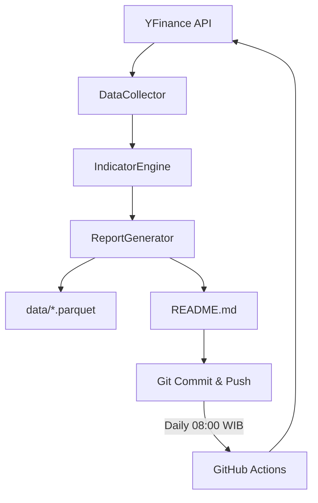

# 📡 Alpha Radar — Automated Market Intelligence

> **Portfolio-ready Project** — Automated daily market pipeline with technical analysis indicators, CI/CD via GitHub Actions, and version-controlled data storage.

[](https://github.com/azizyuwono/alpha-radar/actions)

## 🔍 Live Signals

_Last updated: 2026-06-09 23:53 UTC+7_

| Asset | Price | Signal | RSI (14) | Trend |
|-------|-------|--------|----------|-------|
| XAU/USD (Gold Futures) | $4,270.40 | ⚪ **HOLD** | 31.4 | Bearish |
| BTC/USD (Bitcoin) | $61,213.04 | ⚪ **HOLD** | 13.7 | Bearish |
| ETH/USD (Ethereum) | $1,626.25 | ⚪ **HOLD** | 18.7 | Bearish |


---

## 🏗 Architecture



### How it works
1. **GitHub Actions** triggers daily at **01:00 UTC (08:00 WIB)**.
2. `DataCollector` pulls the latest market data via Yahoo Finance API.
3. `IndicatorEngine` applies **EMA (9/21)**, **RSI (14)**, and **Bollinger Bands**.
4. `ReportGenerator` logs, saves raw Parquet data, and writes the README table above.
5. Changes are committed and pushed — your contribution graph stays green without manual effort.

### Tech Stack
| Layer | Technology |
|-------|-----------|
| **Language** | Python 3.11 |
| **Testing** | `pytest` (4 unit tests) |
| **Automation** | GitHub Actions CI/CD |
| **Data Storage** | Apache Parquet |
| **Data Source** | Yahoo Finance API |

## 🚀 Getting Started

```bash
git clone https://github.com/azizyuwono/alpha-radar.git
cd alpha-radar
pip install -r requirements.txt
python -m pytest tests/
python src/main.py
```

---

_Generated by **Alpha Radar** © 2026 Aziz Yuwono_
